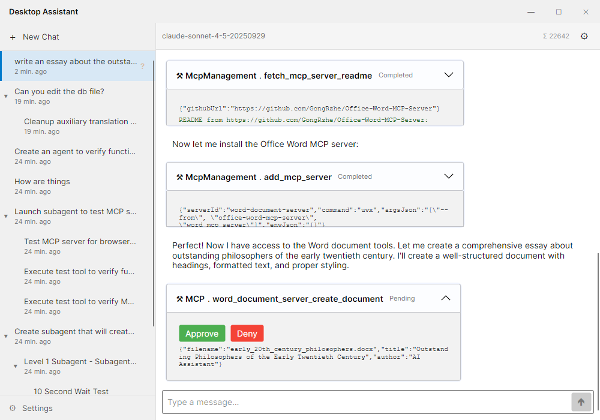

# DesktopAssistant

A desktop AI agent application built with .NET 9 and Avalonia UI. Supports any OpenAI-compatible LLM provider, real-time MCP server installation, conversation branching, multiple simultaneous chats, and recursive sub-agent orchestration.

---

<!-- SCREENSHOT: main UI overview -->


---

## Features

### Conversations
- **Multiple simultaneous chats** — open as many conversations as needed, each running independently
- **Conversation branching** — fork any message to explore alternative responses, similar to ChatGPT's branching model
- **Manual summarization** — right-click any message and summarize the preceding context; a `SummaryNode` is inserted into the message tree, keeping the context window lean without losing history
- **Structured history reduction** — uses a custom `IChatHistoryReducer` that asks the LLM to compact conversation history via a structured `submit_history` tool call, preserving roles, function calls, and function results as proper `ChatMessageContent` objects (compatible with agents using `FunctionChoiceBehavior.Required`)

<!-- GIF: branching + summarization demo -->


### Sub-Agents
- **Recursive sub-agent creation** — enable per conversation; the agent can then spawn child agents to delegate subtasks
- **Configurable sub-agents** — when creating a sub-agent the parent specifies its assistant profile (model, endpoint, temperature), system prompt, and whether the sub-agent can spawn its own sub-agents
- **Task assignment to existing sub-agents** — the parent agent can send new tasks to already-created sub-agents, not just create new ones
- **Conversation tree** — each sub-agent runs as a linked conversation visible in the sidebar, showing its status and relationship to the parent

<!-- GIF: sub-agent creation and task delegation -->


### AI & LLM
- **OpenAI-compatible providers** — works with OpenAI, Azure OpenAI, local models via Ollama, LM Studio, or any OpenAI-compatible endpoint
- **Configurable profiles** — multiple assistant profiles with independent model, endpoint, temperature, and token settings
- **Per-conversation system prompt** — set a custom system prompt for each conversation
- **Semantic Kernel** — powered by [Microsoft Semantic Kernel](https://github.com/microsoft/semantic-kernel) for LLM orchestration
- **Streaming responses** — real-time token streaming

### MCP (Model Context Protocol)
- **Agent-driven installation** — the agent has a built-in set of tools that let it install and configure MCP servers on its own, without user involvement
- **Install from GitHub** — the agent can install any MCP server directly from a GitHub repository URL
- **Built-in server catalog** — a curated list of popular servers is available to the agent as a knowledge base (Tavily Search, Exa Search, Filesystem, Git, Fetch, Memory, Playwright, Qdrant, MySQL/PostgreSQL/SQLite, Kubernetes, Docker, Sequential Thinking, and more)
- **Manual management** — users can install and manage servers directly by editing the config file
- **No restart required** — servers connect at runtime; new tools become available immediately
- **Per-tool auto-approval** — configure which tools run automatically without confirmation prompts


### Security & Storage
- **API keys via Windows DPAPI** — credentials encrypted at rest, never stored in plain text
- **SQLite database** — local storage for conversations, messages, settings
- **No telemetry** — all data stays on your machine

### UI
- **Avalonia UI** — cross-platform desktop framework with Fluent theme
- **System theme detection** — follows Windows dark/light mode
- **Markdown rendering** — assistant responses rendered as rich markdown

---

## Planned Features

- **File support** — work with images, documents, and other file types as conversation context
- **Extended thinking** — support for models with explicit reasoning/thinking steps
- **Agent isolation** — sandboxed execution environments per agent
- **Daemon agents** — long-running background agents and sub-agents
- **Scheduled tasks** — deferred and periodic task execution

---

## Architecture

Clean Architecture with four layers:

```
Domain          — entities, value objects, domain interfaces (no external dependencies)
Application     — use cases, application services, DTOs, interface definitions
Infrastructure  — LLM/SK integration, MCP, SQLite persistence, DPAPI security
UI              — Avalonia MVVM presentation layer (CommunityToolkit.Mvvm)
```

Key infrastructure components:
- `KernelFactory` — creates Semantic Kernel instances per assistant profile
- `AgentKernelFactory` — wraps `KernelFactory`, conditionally registering sub-agent tools and plugins
- `ConversationSession` — encapsulates the LLM turn loop, tool approval, and streaming for a single conversation
- `ConversationSessionService` — singleton session pool keyed by conversation ID
- `SubagentService` — manages sub-agent lifecycle and inter-agent communication
- `SubagentPlugin` — SK plugin exposing `create_subagent`, `send_message_to_subagent`, `list_subagents` tools to the LLM
- `DpapiCredentialStore` — Windows DPAPI credential store
- `AvailableToolsService` — aggregates static SK plugins and dynamic MCP tools
- `SummarizationExecutor` — orchestrates history compaction via `ChatHistoryStructuredReducer` (see [`src/DesktopAssistant.Infrastructure/AI/Summarization/`](src/DesktopAssistant.Infrastructure/AI/Summarization/))

---

## Requirements

- **OS:** Windows 10/11 (DPAPI credential storage is Windows-only)
- **Runtime:** [.NET 9 SDK](https://dotnet.microsoft.com/download/dotnet/9)
- **Node.js:** Required for NPX-based MCP servers (most servers in the catalog)
- **LLM provider:** An API key for OpenAI or any compatible provider, or a locally running model

---

## Getting Started

### 1. Clone the repository

```bash
git clone https://github.com/00wz/DesktopAssistant.git
cd DesktopAssistant
```

### 2. Build and run

```bash
dotnet run --project src/DesktopAssistant.UI
```

Or open `DesktopAssistant.sln` in Visual Studio 2022 / JetBrains Rider and run the `DesktopAssistant.UI` project.

### 3. First-time setup

1. Open **Settings → Profiles**
2. Create an assistant profile — enter your LLM provider base URL and model ID
3. Your API key is stored securely via Windows DPAPI
4. Start a new conversation

### 4. Adding MCP servers

1. Open **Settings → Tools**
2. Browse the built-in catalog or enter a custom server command
3. The server connects immediately — no restart required
4. Configure per-tool auto-approval as needed

---

## Configuration

All settings are stored locally in a SQLite database (`desktop_assistant.db`) in the application directory.

| Setting | Storage |
|---|---|
| API keys | Windows DPAPI (encrypted) |
| Assistant profiles | SQLite |
| Conversations & messages | SQLite |
| Tool auto-approval | SQLite |
| MCP server configs | SQLite |

Logging is configured in `appsettings.json` via Serilog. Log files are written to the `logs/` directory.

---

## Tech Stack

| Component | Library / Version |
|---|---|
| UI Framework | [Avalonia UI](https://avaloniaui.net/) 11.3 |
| MVVM | [CommunityToolkit.Mvvm](https://learn.microsoft.com/en-us/dotnet/communitytoolkit/mvvm/) 8.4 |
| LLM Orchestration | [Microsoft Semantic Kernel](https://github.com/microsoft/semantic-kernel) 1.67 |
| MCP Client | [ModelContextProtocol](https://github.com/modelcontextprotocol/csharp-sdk) 0.2 |
| ORM | Entity Framework Core + SQLite 9.0 |
| Logging | Serilog 4.1 |
| Markdown | LiveMarkdown.Avalonia |
| Target Framework | .NET 9 |

---

## Contributing

Feedback and pull requests are welcome. For major changes, please open an issue first.

## License

[MIT](LICENSE)
